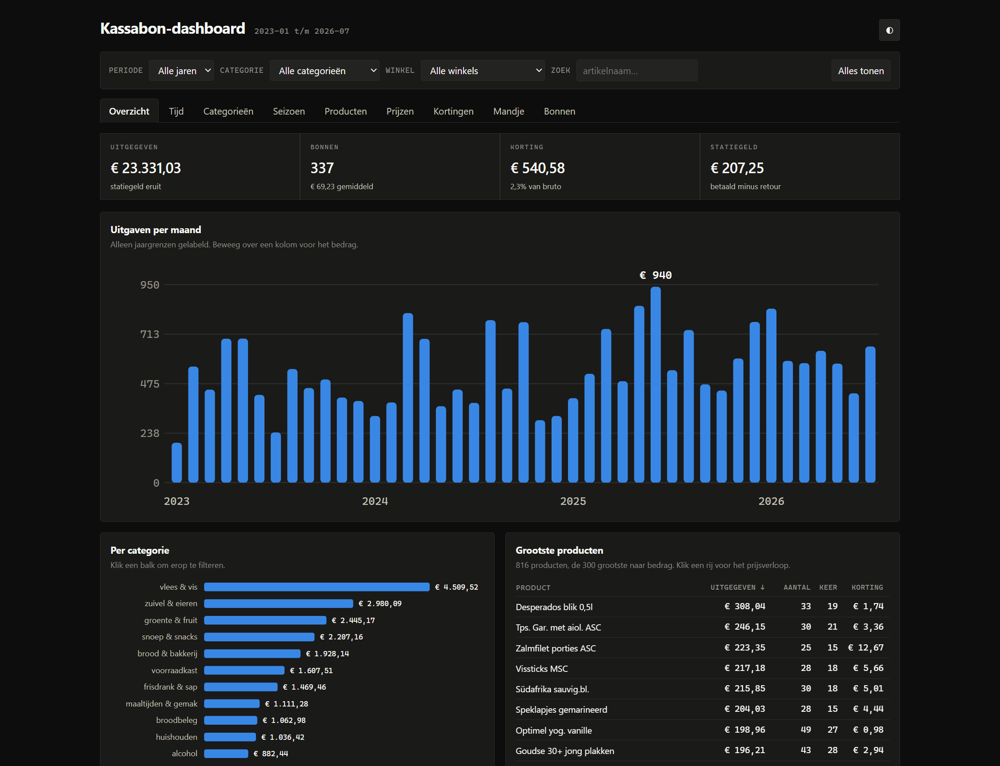

# lidl-receipts-analyser

Haalt je Lidl Plus-bonnen op inclusief alle artikelregels, slaat ze op in SQLite
en analyseert ze offline. Geen dependencies, alleen de
Python-standaardbibliotheek (3.11+).

*[English version](README.md)*



## Snelstart

```bash
git clone https://github.com/erwindamsma/lidl-receipts-analyser
cd lidl-receipts-analyser

./lidl.py config --country NL --language nl   # eenmalig instellen
./lidl.py login                               # eenmalig inloggen
./lidl.py sync                                # alle bonnen naar SQLite
./lidl.py categories                          # artikelen indelen
python3 analysis/dashboard.py                 # -> analysis/dashboard.html
xdg-open analysis/dashboard.html              # of: explorer.exe analysis\dashboard.html
```

- Data in `./data/`: `receipts.db` plus `raw/<id>.json`.
- Refresh token in `~/.config/lidl-receipts/config.json`, mode 0600.
- `categories` is optioneel. Sla je het over, dan valt alles onder
  "ongecategoriseerd".
- Rondkijken zonder dashboard: `./lidl.py info`, `verify`, `dump -o bon.json`.

## Waarom een eigen client

`Andre0512/lidl-plus` en `RoryDotGG/iLidl` doen dit al. De endpoints, headers en
OAuth-parameters komen daaruit. Ze mikken op andere landen, en de Nederlandse bon
wijkt af waar het de parser raakt:

- Komma's als decimaalteken (`39,99`).
- Geen `TOTAL`-regel.
- Kortingen heten `Lidl Plus korting`, `Lidl Plus kassabon`, `In prijs verlaagd`.
- Eén artikel kan meermaals als losse regel op één bon staan. Dat gebeurde op 6
  van de 12 bonnen die ik bekeek, tot 3 regels. Dedupliceren op artikelnummer
  verliest die.

Beide clients automatiseren een browser (selenium-wire, Playwright). Lidl zet
reCAPTCHA Enterprise voor het loginformulier, dus die aanpak betekent bijblijven
bij een captcha die daarop gebouwd is. Inloggen in je eigen browser stapt uit die
wedloop. De auth-flow is zelf zo'n 50 regels en de API twee endpoints, dus een
eigen client werd kleiner dan een wrapper.

Eén ding is het waard om te weten als je zoiets zelf bouwt: **Lidl roteert
refresh tokens.** Elke vernieuwing levert een nieuwe en maakt de oude ongeldig.
Bewaar je alleen de eerste, dan werkt alles maanden en valt het daarna om
([client.py:53-60](lidl_receipts/client.py#L53-L60)).

## Inloggen

`./lidl.py login` start een PKCE-flow in je eigen browser en wacht op de callback.

Die callback is `com.lidlplus.app://callback?code=...`, een app-scheme en geen
webadres. `login` claimt dat scheme bij je desktop, waarna de browser de callback
doorgeeft aan een handler die de code neerlegt in
`~/.config/lidl-receipts/callback.json`. Instellen hoef je niets. De eerste keer
vraagt de browser toestemming. Sta die toe en vink *altijd toestaan* aan.

| Platform | Hoe het scheme geclaimd wordt |
| --- | --- |
| Windows | `HKCU\Software\Classes` via `winreg`, gestart met `pythonw.exe` zodat er geen consolevenster verschijnt |
| WSL | dezelfde registersleutel via PowerShell, terugwijzend de distro in via `wsl.exe` |
| Linux | een `.desktop`-bestand plus `xdg-mime` |
| macOS | niet ondersteund, want Launch Services wil een echte app-bundle |

`./lidl.py handler status` toont de registratie, `handler uninstall` verwijdert
hem, `login --no-handler` slaat hem over.

Een loopback-redirect kan niet. Lidl's IdentityServer accepteert alleen de
redirect-URI van de app zelf en stuurt `http://localhost:.../callback` door naar
`/error`, nog vóór het loginformulier. Dat is een serverantwoord, dus er is op
geen enkel besturingssysteem een poort om op te luisteren.

### Handmatig, zonder handler

Lukt het registreren niet, lees de URL dan uit in plaats van hem te volgen. Zet
vóór het inloggen F12 en het tabblad Network open met **Preserve log** aan. De
callback is het laatste verzoek. Chrome en Edge tonen hem alleen daar, Firefox
laat hem meestal ook in de adresbalk staan. Plak de URL of alleen de
`code=`-waarde.

Codes verlopen binnen minuten, maar de verifier blijft bewaard:

```bash
./lidl.py login --code "com.lidlplus.app://callback?code=..."
```

## Commando's

| Commando | Wat het doet |
| --- | --- |
| `login` | Eenmalige browserlogin, slaat het refresh token op |
| `handler` | `status` / `install` / `uninstall` van de callback-registratie |
| `config` | Toont of wijzigt land, taal, app-versie, datamap |
| `list` | Bonnenlijst uit de API (v2), zonder details op te halen |
| `dump` | Ruwe JSON van één bon (v3). `--id X`, standaard de nieuwste |
| `sync` | Downloadt bonnen die nog niet in de database staan |
| `renormalize` | Herparst opgeslagen ruwe JSON, zonder netwerk |
| `verify` | Controleert of de artikelregels optellen tot het bontotaal |
| `export` | Exporteert naar JSON of CSV |
| `info` | Statistieken over de database |

```bash
./lidl.py dump --normalized          # ruwe JSON plus de genormaliseerde projectie
./lidl.py sync --fast                # stop bij de eerste al bekende bon
./lidl.py sync --since 2026-01-01    # alleen bonnen vanaf een datum
./lidl.py sync --limit 5             # eerst even klein proberen
./lidl.py export --format csv -o items.csv
```

## Datamodel

De **ruwe API-JSON is de bron van waarheid**. Die staat integraal in
`receipts.raw_json` en als los bestand in `data/raw/`. De tabellen `items` en
`item_discounts` zijn een afgeleide cache. Verander je de parser, dan draai je
`./lidl.py renormalize`, zonder netwerk en zonder opnieuw downloaden.

Bedragen staan overal als **hele centen** (`INTEGER`). Ze komen binnen als
locale-strings (`"2,19"`, `"1.234,56"`), en die via floats afronden geeft
centen-drift. De views `v_receipts`, `v_items` en `v_spend` geven euro's terug:

```sql
SELECT name, COUNT(*) AS keer, ROUND(SUM(net), 2) AS uitgegeven
FROM v_items GROUP BY name ORDER BY uitgegeven DESC LIMIT 20;
```

`export --format json` geeft per bon een `items`-array met naam, aantal,
stuksprijs, barcode en kortingen.

## De Nederlandse bon

Twee formaten, afhankelijk van de leeftijd van de bon:

| | `ticketType` | Artikelregels | Statiegeld |
| --- | --- | --- | --- |
| tot ±2022 | `NATIVE` | `itemsLine`, zoals DE en AT | genest object ín de artikelregel |
| daarna | `HTML` | geen JSON, alleen `htmlPrintedReceipt` | eigen regel |

Op een NATIVE-bon telt het statiegeld wel mee in het bontotaal maar niet in het
regelbedrag. De normalisatie maakt er in beide gevallen een losse regel van.

De HTML-variant is een monospace weergave van de papieren bon. Elke span draagt
de waarden als `data-*`-attributen.

```html
<span id="purchase_list_line_2" class="article" data-art-id="0080000"
      data-art-quantity="0,792" data-unit-price="1,39" data-tax-type="B"
      data-art-description="Bananen">Bananen        1,10 B</span>
```

Eén bonregel is verdeeld over meerdere spans met hetzelfde `id`.
[receipt_html.py](lidl_receipts/receipt_html.py) groepeert daarop en levert
dezelfde vorm als `itemsLine`. Drie randgevallen breken de rekensom:

| Regel | Valkuil |
| --- | --- |
| `1,120 kg x 1,37 EUR` | Vervolgregel van een weegartikel, dráágt dezelfde `data-art-id`. Telt dubbel als je er een artikel van maakt |
| `In prijs verlaagd  -1,80` | Korting op de regel erboven, maar zonder `class="discount"` en zonder promotie-id |
| `[X] Emballage  -3,90` | Statiegeldretour: een **losse** regel, geen korting op het artikel erboven |

Bij de eerste verschilt het staartstuk per jaargang: `EUR`, `EUR/kg` en `EUR/kg `
komen alle drie voor. De parser kijkt daarom naar structuur. Een artikelregel
zonder eigen slotbedrag is een vervolgregel.

## Dashboard

`python3 analysis/dashboard.py` schrijft één zelfstandig HTML-bestand voor
`file://`, een halve tot hele megabyte. Alles wordt in de browser berekend, dus
geen server, geen build en geen dependencies.

| Paneel | Wat je ziet |
| --- | --- |
| Overzicht | Uitgaven per maand, per categorie, grootste producten |
| Tijd | Weekdag x uur, uitgaven per weekdag, mandje per uur, dagen tussen bezoeken |
| Categorieën | Gestapeld per jaar, totaal per categorie |
| Seizoen | Seizoensindex per categorie-maand, zomer- en winterproducten |
| Producten | Alle producten, nieuw in je mandje, niet meer gekocht |
| Prijzen | Je eigen mandje-index, hardst gestegen en gedaald |
| Kortingen | Per maand, per categorie in euro's en in procenten |
| Mandje | Verdeling bongrootte, tijd sinds vorig bezoek, klein versus groot |
| Bonnen | Alle bonnen met drill-down naar de artikelregels |

De payload bevat de **losse bonregels** in plaats van voorgeaggregeerde totalen.
Elk paneel leidt zich daaruit af, en zeventienduizend rijen scannen kost de
browser een paar milliseconden. Filteren gaat op jaar, categorie, winkel en
artikelnaam, en die vier scopen alles: de kengetallen, de grafieken en de
tabellen. De filters staan in de URL-hash, dus een weergave is te bookmarken:

```
dashboard.html#tab=seizoen
dashboard.html#jaar=2026&cat=alcohol
dashboard.html#q=mineraalwater&p=Mineraalwater%201.5l
```

Zonder account kijken kan met verzonnen data:

```bash
python3 analysis/demo_data.py data/demo.db
python3 analysis/dashboard.py data/demo.db analysis/demo.html
```

Dat is drie jaar verzonnen boodschappen uit de gedeelde categoriedataset, met een
vaste seed. De screenshot bovenaan komt daaruit.

## Rapport en PDF

```bash
python3 analysis/spending.py > analysis/spending.json
python3 analysis/report.py   > analysis/report.html
./analysis/topdf.sh          # -> analysis/report.pdf
```

`spending.py` rekent, `report.py` tekent. De lopende tekst in het rapport leest
zijn beweringen uit de data, dus die veroudert niet als je dataset groeit.
`topdf.sh` gebruikt Chrome aan de Windows-kant. Met `chromium` of `wkhtmltopdf`
is dat script overbodig.

## Categorieën

Lidl print alleen kassanamen. `./lidl.py categories` bouwt `categories.csv` uit
drie bronnen, in deze volgorde:

1. **jouw eigen correcties** in `categories.csv`, die winnen altijd
2. **[categories.seed.csv](categories.seed.csv)**, ruim achthonderd Nederlandse
   Lidl-artikelen met hun categorie
3. **de trefwoordregels** in [categories.py](lidl_receipts/categories.py)

Je eigen `categories.csv` staat in `.gitignore`, want daar staan jouw bedragen en
aankoopaantallen in. De gedeelde dataset bevat alleen namen en categorieën, en
beperkt zich tot het terugkerende assortiment. Artikelen waarvan de kassanaam te
weinig prijsgeeft blijven in `overig voeding` staan, bewust niet ingedeeld in
plaats van gegokt.

Het commando kruiscontroleert ook de btw-groep. Lidl rekent 9% over boodschappen,
dus 21% bij een voedingscategorie klopt bijna zeker niet:

```bash
./lidl.py categories
# 21% btw maar ingedeeld als voeding:
#   €   439.14  Fris en fruitig wit Z-A          frisdrank & sap
```

Dat is een wijnlijn met een naam die naar frisdrank klinkt. Trefwoorden vangen
zoiets nooit allemaal. De kassa liegt niet over btw.

## Eén product, veel namen

De kassa schrijft hetzelfde artikel op meerdere manieren en geeft het onderweg
nieuwe artikelnummers. Mineraalwater staat er onder zes namen en vier nummers in.
Wie op naam telt, ziet elk product kleiner dan het is.

Geen van beide sleutels werkt alleen. Op naam groeperen splitst een product
waarvan de barcode veranderde, op barcode groeperen splitst een hernoemd product,
en beide gebeuren. Twee regels horen daarom bij elkaar als ze een **naam of een
barcode** delen, transitief doorgetrokken. Dat is een union-find over de
combinaties die op je bonnen voorkomen
([products.py](lidl_receipts/products.py)). De groepering is afgeleid en wordt
niet met de hand bijgehouden. Controleer hem wel op je eigen data: knoopt een
generieke kassacode losse producten aan elkaar, dan zie je dat aan een groep met
opvallend veel namen.

### Optellen mag samengevoegd, prijzen nooit

Groeperen is goed voor "hoeveel gaf ik uit aan komkommer" en fout voor "wat
kostte komkommer". Eén kassanaam dekt vaak meerdere verpakkingen, soms een andere
eenheid:

| barcode | | |
| --- | --- | --- |
| `0082895` | € 2,31 **per kg** | 2025-2026 |
| `20242091` | € 0,91 **per stuk** | 2021-2022 |

Beide zijn "Broccoli". Op één lijn suggereert dat +150%. Per artikelnummer is het
-10% voor de kiloprijs en +9% voor de stuksprijs. Bijna een kwart van de
producten heeft meer dan één artikelnummer.

Elke prijsreeks keert daarom terug naar het artikelnummer. Alleen bedragen worden
per product opgeteld.

## Verificatie

De som van de artikelregels (bedrag minus kortingen) hoort exact gelijk te zijn
aan het `totalAmount` uit de API. Een gemiste, dubbele of verkeerd gelezen regel
breekt die som:

```bash
./lidl.py verify
# All 718 receipts reconcile exactly.
```

Dit is de scherpste controle die er op een bonparser bestaat. Hij ving de
`EUR`-schrijfwijze hierboven, het geneste statiegeld op de NATIVE-bonnen, en een
steekproef die toevallig uit één jaargang kwam. Draai het na elke sync.

Bonnen die zichzelf tegenspreken, waarvan het `taxes`-blok een ander bedrag noemt
dan de artikelregels, blijven als afwijking staan.

## API-referentie

```
POST https://accounts.lidl.com/connect/authorize   (PKCE S256, Country=NL, language=nl-NL)
POST https://accounts.lidl.com/connect/token       (Basic LidlPlusNativeClient:secret)
GET  https://tickets.lidlplus.com/api/v2/NL/tickets?pageNumber=1&onlyFavorite=false
GET  https://tickets.lidlplus.com/api/v3/NL/tickets/{id}
```

Verplichte headers op de tickets-API: `Authorization: Bearer`, `App-Version`,
`Operating-System: iOs`, `App: com.lidl.eci.lidl.plus`, `Accept-Language`.

De API weigert onwaarschijnlijke app-versies. Mislukken calls met een 4xx die de
app-versie noemt, bump hem dan: `./lidl.py config --app-version 17.1.0`.

## Tests

```bash
python3 -m unittest discover -s tests
```

73 tests, allemaal offline: bedrag- en datumparsing, de HTML-bonparser met zijn
randgevallen, normalisatie, de SQLite-store, de sync-importer tegen een gestubde
client, en de callback-handler op alle drie de desktops.

## Licentie

MIT, zie [LICENSE](LICENSE).
